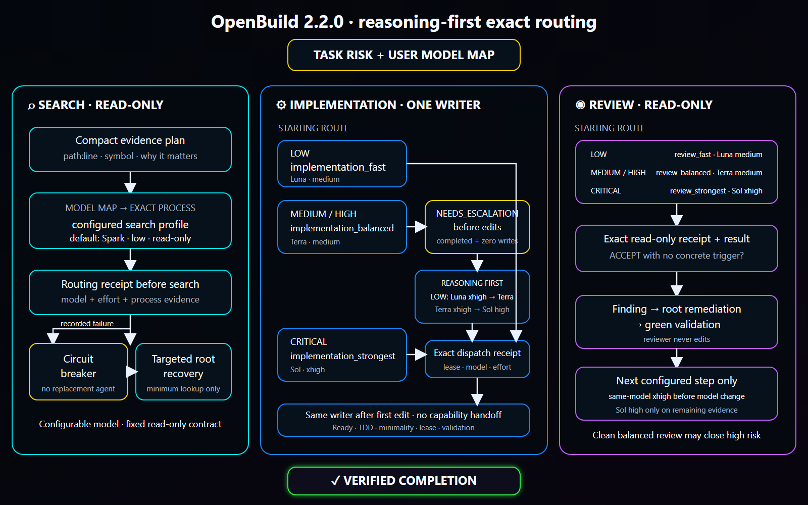

# OpenBuild

[Русская версия](README.ru.md)

OpenBuild is an explicit Codex workflow that can take a plain-language task or an existing specification from repository discovery through implementation, validation, and review. The default route is automatic: invoke Build, describe the outcome, and let it choose the first incomplete phase.

Current release: `2.4.0-alpha.8` ([pinned skill source](https://github.com/GeorgVahi/OpenBuild/tree/v2.4.0-alpha.8/plugins/openbuild/skills/build)).

OpenBuild handles routine agent orchestration itself: it activates exact agents immediately, keeps live runs under one bounded 15-minute observation window, and applies verified same-scope retry or one-rung escalation policies without repeatedly asking the user. Material product, architecture, permission, privacy, destructive, external, and publication decisions remain user-owned.

## Diagrams

### Workflow


### Exact model routing



### Implementation delegation


## Requirements

- Codex with plugin support;
- Python 3.11 or newer;
- Codex CLI authenticated with a saved ChatGPT login;
- Git for repository and release workflows.

OpenBuild does not require direct API credentials. Its delegated agents run as separate subscription-authenticated Codex CLI processes.

## Install or update

Remove an existing installation and marketplace source:

```powershell
codex plugin remove openbuild@openbuild
codex plugin marketplace remove openbuild
```

Add the latest pinned release and install it:

```powershell
codex plugin marketplace add GeorgVahi/OpenBuild --ref v2.4.0-alpha.8
codex plugin add openbuild@openbuild
```

Start a new Codex thread after installation so the updated skill is loaded.

## Usage

Invoke `$openbuild:build` and describe the desired outcome. With no explicit mode, Build works in `auto` and decides whether to create, refine, or execute a specification.

Optional modes:

- `new <idea>` — create or clarify a specification without implementation;
- `refine <path>` — reconcile an existing specification with the repository;
- `run <path>` — implement an existing specification;
- `full <idea>` — specification through implementation and review;
- `auto <idea-or-path>` — explicitly request automatic routing;
- `configure-models` — answer a guided interview to choose the first model, evidence-gated escalation steps, reasoning effort, and critical routes for discovery, specification critics, implementation, and review.

For an existing specification, pass its repository-relative or absolute path. Build never chooses among multiple plausible specification files silently.

## Exact model-routed agents

OpenBuild ships ready-to-use profiles for discovery, implementation, and review. It starts every created agent only through the packaged `codex-exec-explicit-model` runner, which supplies the exact model, reasoning effort, sandbox, and task to a separate `codex exec` process and records a terminal receipt.

Model-map and profile precedence is project override, user override, then packaged default. `$openbuild:build configure-models` builds a complete project or user map in plain language; Build resolves that map before every agent. Search models may be customized, while the canonical read-only discovery contract remains immutable. Native Explorer, name-only custom agents, generic workers, and other routes that cannot prove model and effort are not used.

Discovery returns strict `openbuild.discovery.v1` JSON. The runner fingerprints all Git tracked and untracked/non-ignored content before and after the read-only scout, then validates bounded owners, tests, couplings, flows, safe paths, and tight line ranges before root consumes anything.

The packaged route tries `gpt-5.3-codex-spark` first. If and only if that created process is fully stopped, its creation-bound nonzero Codex exit matches a clean runner exit, and structured private evidence proves Spark is unavailable to the account or its model-specific limit is exhausted, OpenBuild atomically starts one canonical `openbuild_search_balanced` Terra run with the same prompt, fingerprint, instructions, map, and profile bindings. JSONL, stderr, and result artifacts stay bound to one verified no-follow regular-file descriptor through the read; replacement between check, open, and EOF fails closed. Message-only or generic failures, auth/network/CLI/sandbox/timeout/invalid results, drift, replay, and Terra failure go directly to minimum targeted root search; there is no third agent and no fallback with unknown model metadata. Legacy complete maps without the optional availability fields keep the previous blocked behavior. Implementation and review never substitute a model after transport failure.

The packaged map advances reasoning before changing models. Low-risk implementation and review start on Luna medium, then use Luna xhigh, Terra medium, Terra xhigh, and finally Sol high only when a completed evidence trigger remains. Medium/high routes start on Terra medium, then use Terra xhigh before Sol high; critical work starts on Sol xhigh. A validated user map may select a shorter contiguous segment or a higher non-Sol start within the same risk ladder, but it cannot skip a reasoning rung, start non-critical work on Sol, use critical-only strongest outside critical, or replace the direct strongest critical route. Canonical implementation/review profile overrides must also declare their exact `routing_rung` with `routing_tuple_confirmed = true`; a known Luna/Terra/Sol model-and-effort pair must match that rung, while an unknown custom model requires an explicitly confirmed rung and capability smoke instead of inference from its name.

## Safe timeout and recovery

A bounded `wait` timeout is only an observation: OpenBuild watches the same run through progressive 45, 90 and 120 second windows, using a soft CLI exit while preserving `status: timeout`. After those checkpoints it continues observing automatically within one immutable 15-minute budget; at the hard deadline it cancels the run itself and requires full process-tree stop proof. It never releases a writer lease, starts a replacement, or changes model while the creation-bound process tree may still be alive, and it never asks the user whether to continue routine waiting. OpenBuild accepts a contained handoff only after a terminal receipt, kernel-backed full-tree zero proof, root verification, and durable finalization.

Eligible safe same-scope continuation is automatic and bounded: OpenBuild may consume the one-shot same-profile retry or existing root-completion authority only after the required zero-write or post-stop evidence. Only a new checkpoint-bound recovery target writer requires explicit user authorization. After a contained run has terminally failed, its full process tree is proven empty, and its immutable checkpoint still matches the repository, the user may explicitly authorize one recovery target for the same bounded scope. Checkpoint capture fails closed on Git status-suppressing index flags and checks every Windows path component for a reparse point, so hidden tracked edits or an ancestor junction cannot escape the allowed inventory. Immediately before activation, the registry re-captures the exact normal-source or recovery-target snapshot; drift keeps the contained lease unactivated and never opens the prompt gate. Every registry and private-source generation is checked against exact top-level and nested allowlists before durable replacement and again on reload; unknown lifecycle fields, invalid state-specific evidence, or a public checkpoint containing a raw path fail closed even when the generation digest was recomputed. A contained process-bound generation must also bind its provider and IPC plan IDs, guardian identity, affirmative precommit membership, and worker PID/creation identity to the reserved plan before reload or activation. Terminal zero proof and guardian close are complete exact records bound to that same provider, guardian and process identity. A transport-completed `BLOCKED` or verified zero-write `NEEDS_ESCALATION` result is durably rejected without a handoff before containment closes. Its disposition follows an exact matrix: `BLOCKED` retains the source checkpoint, while `NEEDS_ESCALATION` first requires a fresh private snapshot byte-equal to the authoritative pre-snapshot, cannot retain the checkpoint, and may complete only with one matching registry-history event plus reload-validated private-source invalidation. Escalation persists a resumable checkpoint-invalidation boundary: failure retains the lease, and only durable completion permits containment close, release, and the next route step. Terminal release retains a validated privacy-safe digest archive of the terminal receipt, kernel zero proof, guardian close and semantic/handoff disposition after clearing the lease. Failed or ambiguous handoffs remain unaccepted. Windows creates the worker suspended, verifies Job membership, then resumes it; Linux creates the worker directly inside cgroup v2 with `clone3(CLONE_INTO_CGROUP)` before exec and additionally proves a private cgroup/mount namespace with read-only controls, dropped capabilities, no control descriptors, and stable membership. The production Linux path has no post-spawn PID attachment helper. If that native boundary is unavailable, a normal source run may take one proved pre-boundary non-recovery fallback and recovery remains unavailable; ambiguous fallback creation, identity capture, or durable process binding retains the one-shot lease in quarantine. A bind replacement that is already visible is re-barriered and accepted only when its exact digest and process receipt match.

Version 2.4.0-alpha.8 completes M6 runtime capacity, namespace isolation, fairness, and project-wide status. The lane-to-runner bridge now acquires a durable monotonic capacity ticket only for an eligible writer, applies opaque per-lane test DB, Docker Compose, temp, build, and port namespace bindings to the child environment, and releases the exact owner-bound slot on every verified terminal or pre-dispatch failure path. Equal-claim duplicate starts are rejected atomically before registry or run-directory side effects, so they cannot release another live process's slot or promote a waiter early. Public projections cover running, scope wait, integration wait, stale, blocked, and complete outcomes without private paths, ports, nonces, lease IDs, or process identities. Deterministic ten-lane stress proves bounded capacity, FIFO scope/capacity fairness, dependency-unblocking integration priority, unique namespaces, ordered integration, and no lost update, double owner, starvation, or global stop. Real runner tests also keep two independent guardian/worker trees active in separate project lanes. M7 legacy migration, documentation, and the full package gate remain next.

Version 2.4.0-alpha.7 completes the M5 single-writer integration queue. Terminal lane results enter immutable generation-bound intents while one durable executor lease owns the dedicated detached integration and validation checkouts. A prepared fence covers the candidate and the exact `refs/openbuild/integration` compare-and-swap through validation, registry-resident acceptance, and scope release, so crash replay cannot expose an unaccepted base or admit a second integrator. Candidate preparation is replayable after caught failure or real executor death: only a stopped creation-bound owner may be replaced, and the exact integrating intent restores its private checkout to the admitted tip before retry; a live/unknown owner and same-instance thread re-entry remain denied. Dependency consumers carry accepted-base, specification, milestone, read-scope, allowed-set, and rebind-generation proof; an accepted producer marks affected lanes stale until a full rebind. Root-owned prerelease tickets are unique, worker edits to version surfaces are rejected, and a private finalization payload applies the coherent manifest/changelog/README version tuple. Real RecoveryRegistry tests keep two lane writers live concurrently, serialize their commits through the queue, and cover candidate-process death, post-CAS replay, validation failure, dirty checked-out refs, stale rebind, positive no-op release, and version ownership.

Version 2.4.0-alpha.6 recovers one exact Windows containment incident without accepting its diff as a handoff. When an activated `normal-contained` lease is quarantined while still `running` because its guardian stopped before `guardian-zero`, private `_reconcile-containment-loss` now requires the original signed ready, precommit and boundary records; the exact `windows-job` / `kill-on-close-no-breakaway` provider contract; and stopped-or-reused guardian, worker and Codex creation identities. The owner records a distinct observation-bound orphan reconciliation and unsuccessful terminal proof, materializes a missing source checkpoint replay-safely, then reuses the existing abandonment, invalidation, close, archive and release phases. Dirty workspace bytes and the Git index are preserved; no handoff, writer, retry, escalation, diff acceptance or root-completion authority is created. Every other pre-zero shape, Linux provider, missing/tampered evidence, live/unknown identity, unsupported drift shape or ambiguous replay remains fail-closed.

Version 2.4.0-alpha.5 completes the M4 durable milestone DAG scheduler. Task-local plans derive `ready` and `waiting` state under the project generation CAS, prioritize coherent hotspots, preserve independent task progress, and bind scheduler lanes through an explicit schema without reinterpreting legacy milestone names. A dependency-waiting milestone cannot acquire a lane, worktree, hard scope, writer, or recovery authorization. Completion becomes visible to dependents only after focused green, an exact successful lane terminal archive, registry-resident integration acceptance, and acceptance-bound hard-scope release. The real scheduler fixture executes two actual runner/guardian/RecoveryRegistry lifecycles and proves the dependent remains denied between producer terminalization and integration release. The full automatic integration queue and stable 2.4.0 release remain later milestones.

Version 2.4.0-alpha.2 previews the M2 project-lane lifecycle across separate Git worktrees while retaining one contained writer per lane. The coordinator resolves the lane and hard scopes before dispatch; the runner verifies that private binding, routes the existing RecoveryRegistry to the lane worktree, makes the lane-local lease `running`, CAS-attaches it to the project lane, and only then releases the prompt. Two non-overlapping lanes can therefore be write-capable at once; the acceptance fixture launches two actual runner/guardian/fake-Codex process trees and requires both workers to cross the same live barrier. Failure or timeout quarantines only the affected lane. Exact containment loss closes that lane only after its own reconciliation reaches registry vacancy; an ordinary failure with a still-eligible checkpoint instead records `recovery-ready`, and only the explicitly authorized recovery target bound to that digest can re-enter the same lane while its neighbor remains live. Exact schema-1 M1 project state remains a sink-free read and is migrated only by the first locked lane-session generation CAS. A successful handoff waits for the later integration owner without releasing project scopes.

Version 2.4.0 adds ordinary post-zero reconciliation for a completed legacy `normal-contained` lease whose fresh revalidation has the single exact reason `[preexisting-dirty-overlap]`. Owner-derived `terminal-abandonment-v5` binds the run, lease, source, terminal receipt, zero proof, candidate snapshot and allowed set, then invalidates the checkpoint with `terminal-abandoned-legacy-normal-dirty-overlap` before authenticated guardian close, unsuccessful archive and same-lease release. It preserves the writer-produced bytes and Git index without accepting a handoff, diff, commit, retry, escalation, root-completion authority or artificial outside drift. Exact 2.3.6 registries remain readable without rewrite; the first durable v5 transition raises the reader floor to 2.4.0 before source invalidation, so a retained 2.3.6 lifecycle can replay its original private `_reconcile-terminal-abandonment` command when all original owner evidence remains intact.

Version 2.3.6 extends post-zero containment-loss reconciliation only for a legacy `normal-contained` lease whose fresh revalidation has the exact sorted reasons `[git-control-plane-drift, outside-set-drift, preexisting-dirty-overlap]`. Owner-derived `terminal-abandonment-v4` binds that candidate snapshot, permanently invalidates the stale checkpoint with a distinct reason, and reuses the authenticated reconciliation, close, archive, and release phases without accepting a handoff, diff, commit, or root-completion authority. The same triple remains ineligible for ordinary `_reconcile-terminal-abandonment`; every other additional/control-plane reason remains no-mutation fail-closed. Exact floors through 2.3.5 remain readable without rewrite, and the first durable 2.3.6 transition raises the floor before source invalidation.

Version 2.3.5 adds exact post-zero reconciliation for `containment-loss-after-boundary`. A quarantined `stopped-terminal` lease may use private `_reconcile-containment-loss` only when its authenticated guardian zero, terminal/run binding, ready/provider/process evidence, and stopped-or-reused original guardian and worker creation identities all match, while failure, close, handoff, outbox, and prior semantic state are absent. The command records a digest-bound reconciliation event, selects the already applicable terminal-abandonment v1/v2/v3 path, invalidates the checkpoint, records a reconciliation-specific close, archives the unsuccessful abandoned lifecycle, and releases the same lease without accepting a handoff or starting a writer. Tampered/missing evidence, pre-zero or live/unknown process state, another quarantine reason, or an ineligible abandonment reason remains no-mutation fail-closed. Exact reader floors 2.2.0–2.2.3, 2.2.5, and 2.3.2 load without rewrite; the first durable 2.3.5 transition raises the floor before source invalidation.

Version 2.3.4 repairs root completion after an activated `normal-legacy` timeout. Once the failed process tree is proven stopped, the post-vacancy audit accepts that activated `normal-legacy` failure release only when it is the sole registry-history event carrying the request lease ID, no handoff exists, and the immutable run, task, profile, process identity, allowed-set digest, and specification revision binding agree. New runs persist the structured source binding before activation and repeat its digest in both the durable activated receipt and the recomputed failed/stopped terminal receipt. A 2.3.3 checkpoint-limit run whose field is absent, not explicit `null`, is accepted only through its exact migration shape and a canonical `R-<digits>` revision whose exact lowercase `r<digits>` token was already bound into its task label. Reused or mixed-kind lease history fails closed. This path starts no writer, accepts no worker handoff, and still requires independent partial-diff attribution before root-only completion.

Version 2.3.3 prevents the host controller's short default timeout from interrupting the atomic dispatch handshake: every search, critic, implementation, and review `dispatch` now receives an explicit external controller budget of at least 120 seconds (`120000` milliseconds for millisecond-based tools). That budget covers authentication preflight, containment startup, creation-bound Codex readiness, and publication of the activated receipt; it is separate from the activated run's immutable 15-minute observation budget. A controller timeout before the receipt remains a fail-closed transport failure and never authorizes a replacement writer inside the same lifecycle. The release also fixes normal implementation activation when checkpoint capture is unavailable, including `checkpoint byte limit exceeded`: the `normal-legacy` lease now carries a domain-separated lowercase SHA-256 of the requested allowed set instead of an empty `activation_allowed_set_digest`. This binding enables activation but does not claim checkpoint recovery capability.

Version 2.3.2 closes the remaining legacy-normal recovery deadlock without accepting an ambiguous diff. After stopped transport success, authenticated full-tree zero, no handoff/outbox, and exact revalidation reasons `[outside-set-drift, preexisting-dirty-overlap]`, a `normal-contained` lease may use owner-derived `terminal-abandonment-v3`; it permanently invalidates the checkpoint with a distinct reason and reuses the existing identity, guardian, archive, and release gates. The recovery-target-only `terminal-abandonment-v2` contract remains unchanged and retires its consumed recovery authorization. Neither transition creates a handoff, retry, escalation, grant, writer, diff acceptance, or root-completion authority; `normal-legacy`, `normal-fallback`, every additional/unknown/control-plane reason, and ambiguous ownership or containment remain fail-closed without mutation or force-unlock. Root completion is a separate post-vacancy audit. Exact reader floors 2.2.0–2.2.3 and 2.2.5—including registries retained by 2.3.1—load without rewrite; the first durable write by 2.3.2 raises the floor before private-source replacement, after which older readers reject the non-vacant registry until explicit vacant retirement. Version 2.3.1 also requires a valid non-zero creation-bound Codex exit before any structured Spark availability failure can authorize Terra fallback.

Version 2.2.4 preserves exact 2.2.0/2.2.1 terminal receipts whose private binding used `str(run_dir.resolve())`, while current receipts remain bound to the opaque run ID; compatibility matching is exact, path-free in public output, and never rewrites legacy state on read. For an already committed legacy task that now produces the exact mixed `git-control-plane-drift` + `outside-set-drift` state, the same OS account may explicitly confirm the opaque run and full task commit. OpenBuild then creates a canonical owner-private confirmation snapshot, issues one snapshot-bound capability, and uses the hidden post-commit finalizer only after stopped-success/full-tree-zero, no handoff/outbox/quarantine, owner-enforced legacy format+digest, task parent/ancestry, exact producer-versus-root-completion remediation scope, and a repeated Git provenance barrier all match. If the task parent is later than the immutable writer checkpoint, every intervening commit must form one complete linear chain and every path it changes must remain outside the producer allowlist; merges, unrelated history, incomplete ancestry, and producer-scope overlap remain blocked. The first durable terminal intent authoritatively consumes that capability even if a crash precedes the private-source update. A capability expires after five minutes; if its handle is lost or expires before intent, explicitly reconfirming creates a fresh snapshot/capability and invalidates the prior unconsumed handle. Success returns only `terminal-root-completed`; failure returns privacy-safe `blocked`. Do not delete registry files, roll back the published commit, start a replacement writer, or enter private digests/capabilities manually. Ordinary exact outside-only abandonment and the historical 2.2.3 reader-floor transition remain unchanged.

## Progressive review

Review is sequential and read-only. Build starts at the tier required by the change risk, accepts an evidence-backed clean result, and moves one tier higher only when a concrete unresolved finding remains after remediation and validation. Every accepted review must have a successful exact-runner receipt and semantic result.

## Repository and Git behavior

OpenBuild follows applicable `AGENTS.md` files and repository tooling, preserves unrelated worktree changes, keeps one active writer, and leaves Git operations with the root orchestrator. Destructive, external, security-sensitive, or user-authority decisions still require explicit permission.

## Development

Package validation lives in `scripts/validate_package.py`; runner and contract tests live beside it. Release rules are documented in [CONTRIBUTING.md](CONTRIBUTING.md), and release changes in [CHANGELOG.md](CHANGELOG.md).

## License

[MIT](LICENSE)
