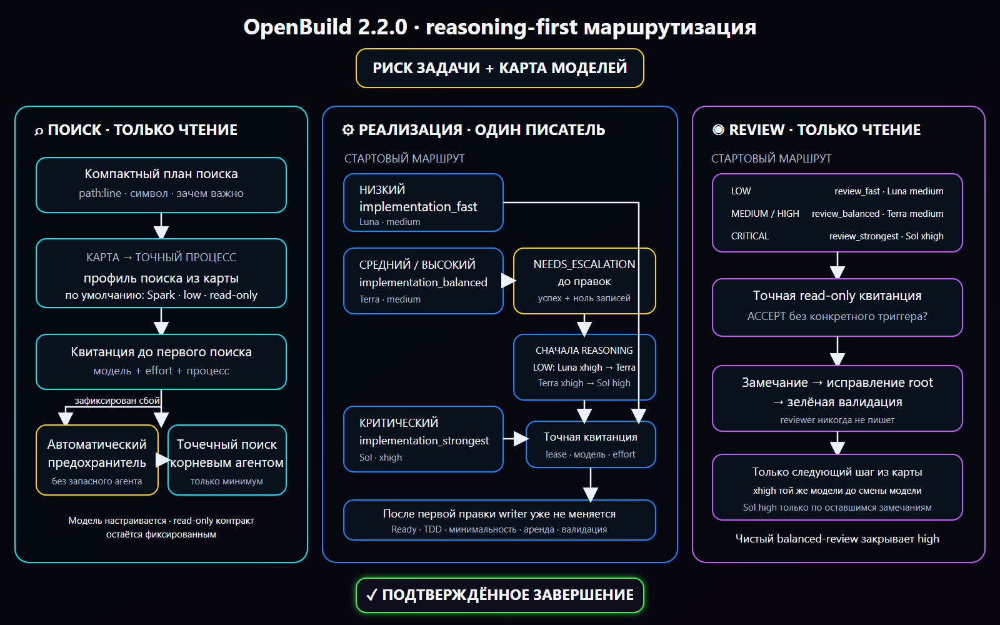
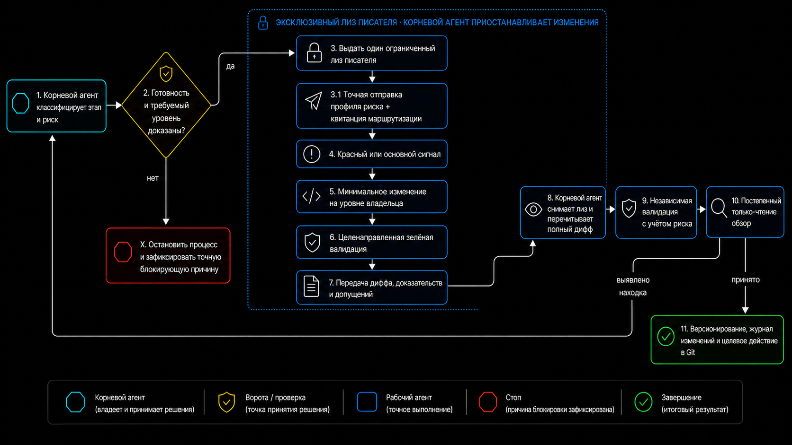

# OpenBuild

[English version](README.md)

OpenBuild — явно вызываемый workflow для Codex, который может провести задачу или существующую спецификацию от поиска по репозиторию до реализации, проверок и review. Основной маршрут автоматический: вызовите Build, опишите результат, а он сам выберет первый незавершённый этап.

Текущий релиз: `2.4.0-alpha.8` ([закреплённый исходник skill](https://github.com/GeorgVahi/OpenBuild/tree/v2.4.0-alpha.8/plugins/openbuild/skills/build)).

OpenBuild сам управляет рутинной оркестрацией агентов: сразу активирует выбранный exact-agent, продолжает наблюдать живой процесс в пределах одного 15-минутного окна и применяет проверенный same-scope retry или переход на одну ступень без постоянных вопросов пользователю. Решения о продукте, архитектуре, разрешениях, приватности, разрушительных и внешних действиях и публикации остаются за пользователем.

## Схемы

### Общий workflow


### Точная маршрутизация моделей



### Делегирование реализации



## Требования

- Codex с поддержкой plugins;
- Python 3.11 или новее;
- Codex CLI с сохранённым входом через ChatGPT;
- Git для работы с репозиторием и релизами.

Прямые API-ключи не нужны. Делегированные агенты запускаются отдельными процессами Codex CLI через подписочную авторизацию.

## Установка или обновление

Удалите текущую установку и источник marketplace:

```powershell
codex plugin remove openbuild@openbuild
codex plugin marketplace remove openbuild
```

Добавьте последний закреплённый релиз и установите plugin:

```powershell
codex plugin marketplace add GeorgVahi/OpenBuild --ref v2.4.0-alpha.8
codex plugin add openbuild@openbuild
```

После установки начните новый тред Codex, чтобы загрузилась обновлённая версия skill.

## Использование

Вызовите `$openbuild:build` и опишите желаемый результат. Без явного режима Build работает в `auto` и сам решает, нужно ли создать, улучшить или выполнить спецификацию.

Дополнительные режимы:

- `new <идея>` — создать или уточнить спецификацию без реализации;
- `refine <путь>` — сверить существующую спецификацию с репозиторием;
- `run <путь>` — реализовать существующую спецификацию;
- `full <идея>` — пройти путь от спецификации до реализации и review;
- `auto <идея-или-путь>` — явно запросить автоматический маршрут;
- `configure-models` — пройти понятное интервью и выбрать первую модель, шаги эскалации по доказательству, reasoning effort и критические маршруты для поиска, критиков спецификации, реализации и review.

Для существующей спецификации передайте относительный от репозитория или абсолютный путь. Build не выбирает молча между несколькими подходящими файлами.

## Агенты с точным выбором модели

OpenBuild поставляет готовые профили для поиска, реализации и review. Каждый создаваемый агент запускается только через встроенный `codex-exec-explicit-model` runner: он передаёт точную модель, reasoning effort, sandbox и задачу в отдельный процесс `codex exec`, а затем сохраняет terminal receipt.

Приоритет карты моделей и профилей: override проекта, override пользователя, затем встроенные значения. `$openbuild:build configure-models` собирает полную проектную или пользовательскую карту простыми вопросами; Build разрешает её перед каждым агентом. Модель поиска можно менять, но канонический read-only контракт поиска остаётся неизменяемым. Native Explorer, name-only custom agents, generic workers и другие маршруты без доказуемых model/effort не используются.

Discovery возвращает строгий JSON `openbuild.discovery.v1`. Runner снимает content-sensitive fingerprint всех tracked и untracked/non-ignored файлов Git до и после read-only scout, а затем проверяет ограниченные owners, tests, couplings, flows, безопасные пути и точные диапазоны строк до любого consume со стороны root.

Встроенный маршрут сначала запускает `gpt-5.3-codex-spark`. Только если этот созданный процесс полностью остановлен, его creation-bound ненулевой Codex exit совпадает с чистым runner exit, а приватное structured evidence доказывает недоступность Spark для аккаунта либо исчерпание её model-specific лимита, OpenBuild атомарно запускает ровно один канонический Terra-run `openbuild_search_balanced` с тем же prompt, fingerprint, instructions, map и profile bindings. JSONL, stderr и result остаются привязаны к одному проверенному no-follow дескриптору обычного файла до конца чтения; подмена между проверкой, открытием и EOF отклоняется fail-closed. Message-only и generic failures, auth/network/CLI/sandbox/timeout, невалидный result, drift, replay и ошибка Terra сразу ведут к минимальному targeted root search; третьего агента и подмены агентом с неизвестной моделью нет. Старые полные карты без optional availability-полей сохраняют прежний blocked-контракт. Implementation и review никогда не подменяют модель после transport failure.

Встроенная карта сначала повышает reasoning и лишь затем меняет модель. Low-risk реализация и review стартуют на Luna medium, затем используют Luna xhigh, Terra medium, Terra xhigh и только по оставшемуся подтверждённому триггеру — Sol high. Маршруты medium/high начинают с Terra medium, переходят на Terra xhigh перед Sol high; critical сразу получает Sol xhigh. Проверенная пользовательская карта может выбрать более короткий непрерывный сегмент или более высокий non-Sol старт внутри той же risk-ladder, но не может пропустить reasoning-ступень, начать non-critical работу с Sol, использовать critical-only strongest вне critical или заменить прямой strongest-маршрут для critical. Override канонического implementation/review-профиля также обязан объявить точный `routing_rung` и `routing_tuple_confirmed = true`: известная пара Luna/Terra/Sol model+effort должна совпадать с этой ступенью, а неизвестная custom-модель требует явно подтверждённой ступени и capability smoke без догадок по её имени.

## Безопасные timeout и recovery

Ограниченный `wait` timeout — только наблюдение: OpenBuild следит за тем же run через прогрессивные окна 45, 90 и 120 секунд, используя мягкий CLI exit при сохранении `status: timeout`. После этих checkpoint OpenBuild автоматически продолжает наблюдение в пределах одного неизменяемого 15-минутного бюджета; на hard deadline он сам отменяет run и требует доказательства полной остановки дерева процессов. Он не освобождает writer lease, не запускает замену и не меняет модель, пока creation-bound дерево процессов может оставаться живым, и не спрашивает пользователя, продолжать ли штатное ожидание. OpenBuild принимает contained handoff только после terminal receipt, kernel-backed доказательства нулевого дерева, независимой проверки root и durable finalization.

Допустимое безопасное same-scope продолжение выполняется автоматически и ограниченно: OpenBuild может использовать one-shot same-profile retry или существующее root-completion authority только после обязательного zero-write либо post-stop evidence. Только новый checkpoint-bound recovery target writer требует явного разрешения пользователя. После terminal failure contained-run, доказанного опустошения всего дерева процессов и повторного совпадения неизменяемого checkpoint пользователь может явно разрешить ровно один recovery target для того же ограниченного scope. Capture checkpoint fail-closed отклоняет скрывающие status флаги Git index и проверяет каждый компонент Windows-пути на reparse point, поэтому скрытое tracked-изменение или junction-предок не может вывести allowed inventory за workspace. Непосредственно перед activation registry повторно снимает точный snapshot normal source или recovery target; drift сохраняет contained lease неактивированным и не открывает prompt gate. Каждое поколение registry и private source проверяется по точным allowlist-схемам верхнего и вложенных уровней до durable replace и повторно при reload; неизвестное lifecycle-поле, неверное state-specific evidence или raw path в public checkpoint fail-closed отклоняется даже с пересчитанным digest поколения. Поколение contained process-bound дополнительно обязано связать provider/IPC plan ID, identity guardian, утвердительное precommit membership и PID/creation identity worker с зарезервированным планом до reload или activation. Terminal zero proof и guardian close являются полными exact-записями, привязанными к тому же provider, guardian и process identity. Transport-completed результат `BLOCKED` или подтверждённый zero-write `NEEDS_ESCALATION` durable-отклоняется без handoff до закрытия containment. Его disposition следует точной матрице: `BLOCKED` сохраняет source checkpoint, а `NEEDS_ESCALATION` сначала требует свежий private snapshot, byte-equal авторитетному pre-snapshot, не может сохранить checkpoint и завершается только при одном совпадающем registry-history event и reload-валидированной invalidation приватного source. Эскалация сохраняет возобновляемую границу checkpoint-invalidation: ошибка удерживает lease, и только durable completion разрешает закрытие containment, освобождение и следующий шаг маршрута. После очистки lease остаётся валидируемый privacy-safe digest-архив terminal receipt, kernel zero proof, guardian close и semantic/handoff disposition. Failed или ambiguous handoff не принимается. В Windows worker создаётся suspended, проверяется внутри Job и только затем возобновляется; в Linux worker создаётся сразу внутри cgroup v2 через `clone3(CLONE_INTO_CGROUP)` до exec, после чего дополнительно доказываются приватные cgroup/mount namespaces, read-only controls, сброшенные capabilities, отсутствие control descriptors и неизменное membership. В production Linux-пути нет helper для post-spawn добавления PID. Если такой native boundary недоступен, обычный source-run может один раз перейти на доказанный pre-boundary non-recovery fallback, а recovery остаётся недоступным; неоднозначность создания fallback, захвата identity или durable process bind сохраняет one-shot lease в quarantine. Уже видимый bind-replace повторно проходит barrier и принимается только при точном совпадении digest и process receipt.

Версия 2.4.0-alpha.8 завершает M6 runtime capacity, namespace isolation, fairness и общий project status. Bridge от lane к runner выдаёт durable monotonic capacity ticket только eligible writer, передаёт child process непрозрачные per-lane bindings для test DB, Docker Compose, temp, build и port namespace и освобождает точный owner-bound slot на каждом проверенном terminal либо pre-dispatch failure пути. Duplicate start с теми же claim отклоняется атомарно до registry и run-directory side effects, поэтому он не может освободить slot другого живого процесса или преждевременно продвинуть waiter. Public projection покрывает running, ожидание scope, ожидание integration, stale, blocked и complete без private paths, ports, nonces, lease IDs и process identities. Детерминированный stress из десяти lanes доказывает bounded capacity, FIFO fairness scope/capacity, приоритет dependency-unblocking integration, уникальные namespaces, упорядоченную integration и отсутствие lost update, double owner, starvation и global stop. Реальные runner-тесты также удерживают две независимые guardian/worker tree активными в отдельных project lanes. Следующим остаётся M7 legacy migration, документация и полный package gate.

Версия 2.4.0-alpha.7 завершает M5 single-writer integration queue. Terminal results lanes поступают в неизменяемые generation-bound intents, а один durable executor lease владеет выделенными detached checkout для integration и validation. Prepared fence покрывает candidate и точный compare-and-swap `refs/openbuild/integration` вплоть до validation, registry-resident acceptance и освобождения scope, поэтому crash replay не может открыть непринятую базу или допустить второго integrator. Candidate preparation повторяется после пойманной ошибки или реальной остановки executor: заменить можно только остановленного creation-bound owner, после чего точный integrating intent восстанавливает private checkout к admitted tip; live/unknown owner и повторный thread-вход того же integrator отклоняются. Dependency consumers несут доказательство accepted base, specification, milestone, read scopes, allowed set и rebind generation; принятие producer помечает затронутые lanes stale до полного rebind. Root-owned prerelease tickets уникальны, worker не может менять version surfaces, а private finalization payload применяет согласованный version tuple manifest/changelog/README. Реальные RecoveryRegistry tests удерживают два lane writers одновременно живыми, последовательно проводят их commits через очередь и покрывают candidate process death, post-CAS replay, validation failure, dirty checked-out refs, stale rebind, положительный no-op release и version ownership.

Версия 2.4.0-alpha.6 восстанавливает один точный Windows containment-инцидент без принятия его diff как handoff. Когда активированный lease `normal-contained` остаётся в `running` и попадает в quarantine из-за остановки guardian до публикации `guardian-zero`, private-команда `_reconcile-containment-loss` теперь требует исходные подписанные ready, precommit и boundary records, точный контракт provider `windows-job` / `kill-on-close-no-breakaway` и остановленные либо повторно использованные creation identity guardian, worker и Codex. Owner записывает отдельную привязанную к observation orphan-reconciliation и unsuccessful terminal proof, replay-safe материализует отсутствующий source checkpoint, затем повторно использует существующие фазы abandonment, invalidation, close, archive и release. Dirty-байты workspace и Git index сохраняются; handoff, writer, retry, escalation, принятие diff или root-completion authority не создаются. Любой другой pre-zero shape, Linux provider, отсутствующее или повреждённое evidence, live/unknown identity, неподдерживаемая drift-комбинация или неоднозначный replay остаются fail-closed.

Версия 2.4.0-alpha.5 завершает M4 durable milestone DAG scheduler. Task-local планы выводят состояния `ready` и `waiting` под project generation CAS, ставят coherent hotspots первыми, сохраняют независимый прогресс разных задач и связывают scheduler lanes явной схемой без переосмысления legacy milestone-имён. Milestone с незавершёнными зависимостями не может получить lane, worktree, hard scope, writer или recovery authorization. Completion становится видимым зависимым milestones только после focused green, точного успешного terminal archive lane, registry-resident integration acceptance и привязанного к acceptance освобождения hard scopes. Реальный scheduler fixture выполняет два настоящих runner/guardian/RecoveryRegistry lifecycle и доказывает, что dependent остаётся запрещён между terminalization producer и integration release. Полная automatic integration queue и стабильный релиз 2.4.0 остаются следующими milestones.

Версия 2.4.0-alpha.2 предварительно выпускает M2 lifecycle project lanes в отдельных Git worktree, сохраняя не более одного contained writer в каждой lane. Coordinator разрешает lane и hard scopes до dispatch; runner проверяет эту приватную привязку, направляет существующий RecoveryRegistry в worktree lane, переводит lane-local lease в `running`, CAS-прикрепляет его к project lane и только затем открывает prompt. Поэтому две непересекающиеся lanes могут одновременно быть write-capable; acceptance fixture запускает два настоящих дерева процессов runner/guardian/fake-Codex и требует, чтобы оба worker одновременно пересекли общий live barrier. Ошибка или timeout quarantines только затронутую lane. Точный containment loss закрывает эту lane лишь после reconciliation и vacancy собственного registry; обычный failure с всё ещё допустимым checkpoint вместо close записывает `recovery-ready`, после чего в ту же lane может войти только явно разрешённый recovery target с тем же digest, пока соседняя lane остаётся live. Точный schema-1 M1 project state остаётся sink-free read и мигрирует только при первом locked lane-session generation CAS. Успешный handoff ждёт будущего integration owner без освобождения project scopes.

Версия 2.4.0 добавляет обычный post-zero reconciliation для завершённого legacy lease вида `normal-contained`, чья свежая revalidation возвращает единственную точную причину `[preexisting-dirty-overlap]`. Owner-derived `terminal-abandonment-v5` связывает run, lease, source, terminal receipt, zero proof, candidate snapshot и allowed set, затем инвалидирует checkpoint причиной `terminal-abandoned-legacy-normal-dirty-overlap` до authenticated guardian close, unsuccessful archive и release того же lease. Переход сохраняет полученные от writer байты и Git index без принятия handoff, diff, commit, retry, escalation, root-completion authority или искусственного outside drift. Точные registry версии 2.3.6 читаются без rewrite; первый durable-переход v5 поднимает reader floor до 2.4.0 перед source invalidation, поэтому retained lifecycle 2.3.6 может повторить исходную приватную команду `_reconcile-terminal-abandonment`, если все исходные owner evidence сохранены.

Версия 2.3.6 расширяет post-zero containment-loss reconciliation только для legacy lease вида `normal-contained`, чья свежая revalidation возвращает точный отсортированный набор `[git-control-plane-drift, outside-set-drift, preexisting-dirty-overlap]`. Owner-derived `terminal-abandonment-v4` связывает этот candidate snapshot, навсегда инвалидирует устаревший checkpoint отдельной причиной и повторно использует authenticated reconciliation, close, archive и release без принятия handoff, diff, commit или root-completion authority. Та же тройка остаётся недопустимой для обычной `_reconcile-terminal-abandonment`; любые другие дополнительные или control-plane reasons остаются no-mutation fail-closed. Точные floors вплоть до 2.3.5 читаются без rewrite, а первый durable-переход 2.3.6 поднимает floor до invalidation source.

Версия 2.3.5 добавляет точную post-zero reconciliation для `containment-loss-after-boundary`. Quarantined lease в состоянии `stopped-terminal` может вызвать private-команду `_reconcile-containment-loss` только при совпадении authenticated guardian zero, terminal/run binding, ready/provider/process evidence и остановленных либо повторно использованных creation identity исходных guardian и worker, а также при отсутствии failure, close, handoff, outbox и прежнего semantic state. Команда записывает digest-bound reconciliation event, выбирает уже применимый путь terminal-abandonment v1/v2/v3, инвалидирует checkpoint, фиксирует reconciliation-specific close, архивирует lifecycle как unsuccessful/abandoned и освобождает тот же lease без принятия handoff и без запуска writer. Повреждённое или отсутствующее evidence, pre-zero либо live/unknown process state, другая причина quarantine или неподходящая причина abandonment остаются no-mutation fail-closed. Точные reader floors 2.2.0–2.2.3, 2.2.5 и 2.3.2 читаются без rewrite; первый durable-переход версии 2.3.5 поднимает floor до invalidation source.

Версия 2.3.4 восстанавливает root completion после таймаута активированного `normal-legacy`. Когда остановка failed process tree доказана, post-vacancy audit принимает этот activated `normal-legacy` failure release только если он является единственным registry-history событием с lease ID запроса, handoff отсутствует, а неизменяемые run, task, profile, process identity, allowed-set digest и binding ревизии спецификации совпадают. Новые run сохраняют структурированную source binding до activation и повторяют её digest в durable activated receipt и повторно вычисленном failed/stopped terminal receipt. Run версии 2.3.3 после checkpoint-limit, где поле отсутствует, а не равно явному `null`, принимается только по его точной migration-форме, канонической ревизии `R-<digits>` и уже связанному с task label точному lowercase-токену `r<digits>`. Повторно использованная или mixed-kind история lease отклоняется fail-closed. Этот путь не запускает writer, не принимает worker handoff и по-прежнему требует независимой атрибуции partial diff до root-only completion.

Версия 2.3.3 не позволяет короткому default timeout внешнего controller прервать atomic dispatch handshake: каждый `dispatch` для search, critic, implementation и review теперь получает явный внешний controller budget не менее 120 секунд (`120000` миллисекунд для инструментов с миллисекундной настройкой). Этот бюджет покрывает authentication preflight, запуск containment, готовность creation-bound Codex и публикацию activated receipt; он не входит в неизменяемый 15-минутный observation budget уже активированного run. Timeout controller до получения receipt остаётся fail-closed transport failure и не разрешает replacement writer внутри того же lifecycle. Релиз также исправляет activation обычной implementation-задачи при недоступном checkpoint capture, включая `checkpoint byte limit exceeded`: lease `normal-legacy` теперь получает domain-separated lowercase SHA-256 запрошенного allowed set вместо пустого `activation_allowed_set_digest`. Эта binding разрешает activation, но не изображает наличие checkpoint recovery capability.

Версия 2.3.2 закрывает оставшееся recovery-зависание legacy normal lease без принятия неоднозначного diff. После успешной остановки transport, подтверждённого full-tree zero, отсутствия handoff/outbox и точных reasons `[outside-set-drift, preexisting-dirty-overlap]` lease вида `normal-contained` может использовать owner-derived `terminal-abandonment-v3`: переход навсегда инвалидирует checkpoint отдельной причиной и повторно использует существующие identity, guardian, archive и release gates. Контракт `terminal-abandonment-v2` остаётся только для recovery target и завершает использованную recovery-авторизацию. Ни один переход не создаёт handoff, retry, escalation, grant, writer, принятие diff или root-completion authority; `normal-legacy`, `normal-fallback`, любые дополнительные, неизвестные или control-plane reasons и неоднозначная ownership/containment остаются fail-closed без мутации или force-unlock. Root completion выполняется отдельным post-vacancy audit. Точные reader floors 2.2.0–2.2.3 и 2.2.5, включая registry, удержанные версией 2.3.1, читаются без rewrite; первый durable write версии 2.3.2 поднимает floor до замены private source, после чего старые readers отклоняют non-vacant registry до явного vacant retirement. Версия 2.3.1 также требует корректный ненулевой creation-bound Codex exit до любой авторизации Terra по структурированному Spark availability failure.

Версия 2.2.4 сохраняет точные terminal receipt 2.2.0/2.2.1, где private binding использовал `str(run_dir.resolve())`, а текущие receipt остаются привязаны к opaque run ID; compatibility match точный, не выводит path публично и не переписывает legacy state при чтении. Для уже закоммиченной legacy-задачи с exact mixed-состоянием `git-control-plane-drift` + `outside-set-drift` текущая OS-учётка может явно подтвердить opaque run и полный task commit. После этого OpenBuild создаёт canonical owner-private confirmation snapshot, выпускает одну привязанную к нему capability и вызывает hidden post-commit finalizer только при совпадении stopped-success/full-tree-zero, отсутствия handoff/outbox/quarantine, owner-enforced legacy format+digest, parent/ancestry commit, точного producer-versus-root-completion remediation scope и повторного Git provenance barrier. Если task parent новее immutable checkpoint writer’а, все промежуточные коммиты обязаны образовывать одну полную линейную цепочку, а каждый изменённый ими path должен оставаться вне producer allowlist; merge, unrelated или неполная history и пересечение с producer scope блокируются. Первый durable terminal intent авторитетно потребляет capability, даже если crash случился до обновления private source. Capability истекает через пять минут; если handle потерян или истёк до intent, явное повторное подтверждение создаёт свежие snapshot/capability и делает прежний непотреблённый handle недействительным. Успех возвращает только `terminal-root-completed`, отказ — privacy-safe `blocked`. Не удаляйте registry-файлы, не откатывайте опубликованный commit, не запускайте replacement writer и не вводите private digest/capability вручную. Обычный exact outside-only abandonment и исторический переход reader floor 2.2.3 не меняются.

## Progressive review

Review выполняется последовательно и только для чтения. Build начинает с уровня, соответствующего риску изменений, принимает подтверждённый чистый результат и поднимается ровно на один уровень только после конкретного нерешённого замечания, исправления и повторной проверки. Для принятого review обязательны успешный receipt точного runner’а и семантически завершённый результат.

## Репозиторий и Git

OpenBuild соблюдает применимые `AGENTS.md` и инструменты репозитория, сохраняет посторонние изменения worktree, допускает только одного активного writer и оставляет Git-операции root-оркестратору. Разрушительные, внешние, security-sensitive действия и решения, принадлежащие пользователю, по-прежнему требуют явного разрешения.

## Разработка

Проверка пакета находится в `scripts/validate_package.py`, рядом лежат тесты runner’а и контрактов. Правила релиза описаны в [CONTRIBUTING.md](CONTRIBUTING.md), изменения релизов — в [CHANGELOG.md](CHANGELOG.md).

## Лицензия

[MIT](LICENSE)
