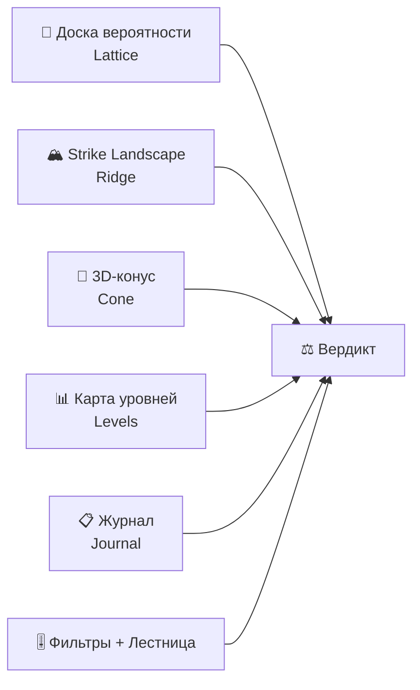

# Усиление Seiltanzer Terminal: аналитика уровня хедж-фонда

> Все предложения используют **только бесплатные данные** (yfinance, Yahoo WS),
> интегрируются в текущую архитектуру и ориентированы на **ручной трейдинг FVG/AMD сетапов**.

---

## Карта текущих блоков (что уже есть)



---

## Приоритет 1 — Максимальный edge при минимальной сложности

### 1. 🌡️ Volatility Risk Premium (VRP) — «Термометр перегрева»

**Что это:** Разница между **implied vol** (что рынок ожидает) и **realized vol** (что происходит на самом деле). Это самый стабильный edge в опционах — хедж-фонды (Citadel, Two Sigma) строят на нём целые стратегии.

**Какой edge даёт для ручного трейдинга:**
- **VRP > 0 (implied > realized):** рынок «напуган» больше, чем реальность → опционные коридоры завышены → mean reversion вероятнее → **дальний тейк реалистичнее, фиксация раньше не нужна**
- **VRP < 0 (implied < realized):** рынок «недооценивает» реальное движение → пробои и тренды будут БОЛЬШЕ, чем опционы предсказывают → **стоп шире, тейк агрессивнее**
- **VRP ≈ 0:** нейтрально, стандартные правила

**Откуда данные (бесплатно):**
- Implied vol: уже есть — `chain.metrics.implied_move.sigma_annual`
- Realized vol: уже есть — `engine.market.baseline_vol()` (20-дневная из daily bars)
- Всё готово, нужна только визуализация и интеграция в вердикт

**Визуализация — «Спидометр VRP»:**
```
┌────────────────────────────────────┐
│  VOLATILITY RISK PREMIUM           │
│                                    │
│   Implied   ████████████░░ 24.3%   │
│   Realized  ██████████░░░░ 18.7%   │
│                                    │
│   VRP: +5.6% ▲  ПЕРЕГРЕВ           │
│   ──────────●───────────────       │
│   -10%    0    +5%   +10%  +15%    │
│                                    │
│   → Опционный коридор завышен:     │
│     mean reversion в пользу,       │
│     дальний тейк реальнее.         │
└────────────────────────────────────┘
```

**Интеграция:**
- Новое поле `vrp` в `tick_payload()` (engine.py, 5 строк кода)
- Добавить в `_verdict()` как фактор оценки (если VRP > 5% → score +1)
- Визуально: горизонтальная полоса под блоком фильтров

---

### 2. 📐 Implied Volatility Surface — «Рентген рынка»

**Что это:** 3D-поверхность implied volatility по двум осям — **strike** и **время до экспирации**. Это главный инструмент опционных деск хедж-фондов. Сейчас вы видите только одну «срез» (ближайшую экспирацию) — surface показывает ВСЮ картину.

**Какой edge даёт:**
- **Skew по strike**: где IV аномально высокая → рынок видит риск в этом направлении
- **Term structure**: контанго/бэквордация → ожидание когда будет движение
- **«Горячие точки»**: локальные пики IV → страйки, где ставят крупные хеджи
- **Динамика**: как поверхность меняется со временем → смена настроения

**Откуда данные:**
- yfinance `Ticker.options` → несколько экспираций (уже берём 3 в `_fetch_term`)
- Расширить до 5-6 экспираций: каждая даёт strike×IV сетку

**Визуализация — WebGL 3D Surface (Plotly, как конус):**

Представьте: ось X = страйк (цена), ось Y = дни до экспирации, ось Z = implied vol.
Поверхность окрашена в heatmap (синий = низкая IV, красный = высокая).
Текущая цена — вертикальная плоскость-сечение. Ваши stop/take — линии на полу.

Над этим наложить:
- Вертикальный «луч» текущей цены
- Горизонтальные маркеры: стоп и тейк
- Аннотацию: «ваш тейк — в зоне высокой IV (рынок считает это реальным)»

> [!TIP]
> Plotly gl3d уже подключён в проекте (`vendor/plotly-gl3d.min.js`) — surface строится
> как `Plotly.newPlot(div, [{type: 'surface', z: ivMatrix, x: strikes, y: days}])`.
> Второй WebGL-блок рядом с конусом.

---

### 3. 🔥 GEX Evolution — «Стены строятся и рушатся»

**Что это:** Анимированная эволюция гамма-экспозиции дилеров во времени. Сейчас вы видите только **текущий** GEX-профиль — а самое ценное это **как стены двигаются**.

**Какой edge даёт:**
- Стена OI **растёт** → усиливается как магнит (пиннинг)
- Стена OI **тает** → уровень ослабевает, пробой вероятнее
- Новая стена **появляется** впереди цены → институционалы строят позицию
- **Смена знака GEX** рядом с ценой → переход из зоны пиннинга в зону ускорения

**Откуда данные:**
- Уже есть! `cache.chain_snapshots()` хранит историю OI и GEX
- Нужно только визуализировать динамику

**Визуализация — «GEX Heatmap Timeline»:**
```
            ← ВРЕМЯ (снапшоты) →
  Strike ┌──────────────────────┐
  22000  │ ░░░░░░░░████████████ │ ← стена РАСТЁТ
  21500  │ ░░░░██████████░░░░░░ │ ← стена была, УШЛА
  21000  │ ████████████████████ │ ← стабильный пиннинг
  20500  │ ░░░░░░░░░░░░░░░░░░░░ │
  20000  │ ░░░████████░░░░░░░░░ │ ← путовая стена тает
         └──────────────────────┘
         ▲ цена сейчас здесь
```

Canvas 2D heatmap: ось X = время (снапшоты, 10 штук), ось Y = страйки (в шкале инструмента),
цвет = |net GEX|. Зелёный = положительная гамма (пиннинг), красный = отрицательная (ускорение).
Горизонтальная линия = текущая цена. Пульсирующие маркеры = стоп и тейк.

---

### 4. 📊 Volume Profile / Market Profile — «Где стоит реальный объём»

**Что это:** Горизонтальная гистограмма объёма по ценовым уровням за день/неделю. Показывает **Point of Control** (POC) — цену, где прошёл максимальный объём, и **Value Area** (70% объёма). Это стандарт CME-трейдеров и пропов.

**Какой edge даёт:**
- **POC** — сильнейший уровень притяжения цены (аналог VWAP, но точнее)
- **Value Area High/Low** — границы «справедливой цены» → пробой → тренд
- **Тонкие зоны объёма** — цена проскакивает быстро (хорошо для импульсных входов)
- Комбинация с FVG-зонами: если FVG совпадает с тонкой зоной VP → вход надёжнее

**Откуда данные:**
- `yfinance.Ticker(yahoo).history(period="5d", interval="5m")` — бесплатно
- Для ETF-инструментов (SPY, QQQ, DIA) объём реальный и качественный
- Для кэш-индексов (^NDX) объёма нет → показывать «недоступно» честно

**Визуализация — горизонтальная гистограмма на карте уровней:**

Встраивается **слева** от карты уровней (Levels Map) как вертикальная полоса:
```
      Volume Profile     │  Levels Map
                         │
  ████████████░░ POC ────│── 21,450
  ██████████░░░░ VAH ────│── 21,520 ──── take
  ████░░░░░░░░░░         │── 21,300
  █░░░░░░░░░░░░░ thin ───│── 21,200 ← цена проскочит
  ██████░░░░░░░░ VAL ────│── 21,100
  ███████████░░░         │── 21,000 ──── stop
```

---

## Приоритет 2 — Глубокий контекст рынка

### 5. 🔗 Cross-Asset Correlation Dashboard — «Кто за кем»

**Что это:** Матрица корреляций в реальном времени между инструментами стратегии + ключевыми драйверами (DXY, US10Y, VIX). Когда корреляции ломаются — это сигнал.

**Какой edge:**
- NAS100 и SP500 обычно коррелируют ~0.95. Если корреляция падает → дивергенция → сигнал
- XAU обратно коррелирует с DXY. Если корреляция ломается → крупный сдвиг
- Сетап 4 (SP500+NAS100 корреляция) — буквально требует этот инструмент

**Данные:** yfinance — все тикеры уже определены в `INSTRUMENTS` + добавить `DXY=X`, `^TNX` (10Y yield).

**Визуализация — динамическая heatmap матрица:**

```
         NAS  SP5  US30 XAU  EUR  DXY  VIX
  NAS100  ■   .95  .91  -.3  .15  -.4  -.7
  SP500  .95   ■   .93  -.2  .12  -.3  -.7
  US30   .91  .93   ■   -.1  .10  -.3  -.6
  XAU    -.3  -.2  -.1   ■   .45  -.8  .30
  EURUSD .15  .12  .10  .45   ■   -.9  .10
  DXY    -.4  -.3  -.3  -.8  -.9   ■   .25
  VIX    -.7  -.7  -.6  .30  .10  .25   ■
```

Цвет: тёмно-синий (высокая +), белый (0), тёмно-красный (высокая –).
Мерцающие ячейки = корреляция АНОМАЛЬНО отклонилась от 30-дневной нормы.

---

### 6. 🎭 Put/Call Ratio + OI Flow — «Настроение толпы»

**Что это:** Отношение объёма/OI путов к коллам и его динамика. Экстремальные значения = контрарный сигнал (все боятся → разворот вверх; все жадные → разворот вниз).

**Какой edge:**
- **P/C ratio > 1.2** → экстремальный страх → рынок перепродан → бычий контрарный сигнал
- **P/C ratio < 0.6** → экстремальная жадность → рынок перекуплен → медвежий
- **Резкое изменение OI** на конкретных страйках → институциональное позиционирование

**Данные:** Уже есть — `call_oi` и `put_oi` из цепочки.

**Визуализация — мини-график в шапке + интеграция в вердикт:**

```
  P/C Ratio: 0.87 ░░░░░░████░░░░░░ НЕЙТРАЛЬНО
              0.4  0.6  0.8  1.0  1.2  1.4
              жадность ←──────→ страх
```

Плюс: timeline P/C ratio за последние N снапшотов (уже есть в cache).

---

### 7. 🌊 Implied Move Fan — «Веер ожиданий рынка»

**Что это:** Вместо одного коридора implied move (±1σ до экспирации) — **веер** из нескольких экспираций, расширяющийся во времени. Показывает, как рынок видит будущее на разных горизонтах.

**Какой edge:**
- Если тейк **внутри** 1σ ближайшей экспирации → реалистичен
- Если тейк **за пределами** 2σ → рынок считает маловероятным
- Веер сужается (контанго) → рынок ждёт «потом» → тейк по времени ок
- Веер расширяется (бэквордация) → движение СЕЙЧАС → быстрый вход

**Данные:** Расширить `_fetch_term` до 5 экспираций → для каждой ATM straddle → implied move.

**Визуализация — расширяющийся конус на карте уровней:**

```
         Сейчас    +2д      +9д     +30д
           │    ╱               ╲
  take ────│──╱── +1σ(2д) ──────╲───── +1σ(30д)
           │╱                     ╲
  price ───●───────────────────────────
           │╲                     ╱
  stop ────│──╲── -1σ(2д) ──────╱───── -1σ(30д)
           │    ╲               ╱
```

Полупрозрачные цветные зоны (ближняя — яркая, дальняя — бледная).
Стоп и тейк — горизонтальные линии. Видно, когда тейк попадает в зону ожидания рынка.

---

### 8. 🧬 Regime DNA — «Что за рынок сейчас»

**Что это:** Классификатор рыночного режима на основе комбинации: ATR-фазы (уже есть), тренда, средней длительности движений, автокорреляции возвратов. Вместо одного слова «нормальный» — многомерный портрет.

**Какой edge:**
- **Трендовый режим + низкая автокорреляция** → FVG sweep работает, дальний тейк ок
- **Mean-reversion режим + высокая автокорреляция** → фиксируй раньше, AMD-стиль
- **Переходный режим** → режь размер, жди ясности

**Данные:** Только daily bars (уже есть). Считается чисто из closes/highs/lows.

**Визуализация — радар/spider chart (5 осей):**

```
         Тренд
          ╱╲
         ╱  ╲
    Вола ╱    ╲ Инерция
        │  ●   │
        │ ╱ ╲  │
  Разброс   Кластер
```

5 осей: сила тренда, волатильность, инерция (автокорреляция), разброс (kurtosis), кластеризация волы. Текущий режим — закрашенный полигон. Фоном — «нормальный» полигон для сравнения.

---

## Приоритет 3 — Продвинутые визуальные инструменты

### 9. 🏗️ OI Architecture — «Архитектура позиционирования»

**Что это:** Двумерная heatmap: ось X = экспирации, ось Y = страйки, цвет = open interest. Показывает, где сконцентрированы позиции по ВСЕМ экспирациям одновременно. Это «рентген» институционального позиционирования.

**Какой edge:**
- **Кластер OI** на определённом страйке через несколько экспираций → «бетонная стена»
- **Пустая зона** → цена пройдёт легко (мало хеджей)
- **Миграция OI** к новым страйкам → рынок двигает хеджи → ожидание движения

**Данные:** yfinance — `option_chain` для 5-6 экспираций. Один доп. REST-запрос каждые 10 мин.

**Визуализация — Canvas 2D heatmap:**

```
  Exp →   28Jul  1Aug   8Aug  15Aug  22Aug
  Strike
  22000   ░░░░   ░░░░   ██░░   ████   ████  ← call wall нарастает
  21500   ████   ████   ████   ██░░   ░░░░  ← позиция УХОДИТ
  21000   ██░░   ████   ████   ████   ████  ← бетонная стена
  20500   ░░░░   ░░░░   ░░░░   ░░░░   ░░░░
  20000   ░░░░   ██░░   ████   ████   ████  ← put wall строится
```

Синий = call OI, красный = put OI. Яркость = интенсивность.

---

### 10. 📈 Edge Tracker Dashboard — «Работает ли ваш край»

**Что это:** Расширение существующего `edge_track` в журнале до полноценного дашборда с визуализацией. Отвечает на главный вопрос: **работает ли моя аналитика?**

**Что показывать:**
- **Equity curve** — кривая баланса по закрытым сделкам (в R-координатах)
- **Edge vs факт scatter plot** — ось X = edge при входе, ось Y = результат (R)
  - Если точки в правом-верхнем квадранте → edge предсказывает прибыль → РАБОТАЕТ
- **Winrate по зонам VRP** — выше ли WR когда VRP > 5%?
- **Winrate по гамма-режиму** — лучше ли когда gamma-zone = positive?
- **Setup efficiency timeline** — как меняется эффективность каждого сетапа

**Данные:** Журнал (`trades.db`) — уже есть все данные.

**Визуализация:**

```
  Equity Curve (R)
  +8R ─────────────╱──────────────
  +4R ────────╱───╱───╲──╱────────
   0R ──╱──╱──────────────────────
  -2R ─╱──────────────────────────
       T1  T5  T10  T15  T20  T25

  Edge vs Result
  Result(R)
  +2.5 │        ●  ●
  +1.0 │    ●  ●●  ●     ← edge > 0 → profit ✓
   0.0 │──●──────●────────
  -1.0 │  ●  ●
       └─────────────────
       -10%  0%  +10%  +20%  Edge
```

---

### 11. 🎯 Smart Entry Zones — «Где входить точнее»

**Что это:** Комбинация нескольких уровней в «зону оптимального входа»:
- FVG-зона (уже есть, рисуется вручную)
- GEX zero-flip (уже есть)
- VWAP (уже есть)
- POC из Volume Profile (новое)
- OI wall ближайший (уже есть)
- Implied move band edge (уже есть)

Когда 3+ уровня **кластеризуются** в узкой зоне → это суперсильная зона входа.

**Визуализация — overlay на Levels Map:**

Подсветка зоны, где сходятся несколько уровней. Интенсивность цвета = количество совпадений.
Tooltip: «4/6 уровней сходятся в зоне 21,340–21,380: GEX flip + VWAP + FVG + put wall».

---

### 12. 🕐 Session Clock + Liquidity Bands — «Когда торговать»

**Что это:** Визуальный циферблат, показывающий текущее положение в торговой сессии с наложением типичных паттернов ликвидности.

**Edge:**
- AMD-стиль: накопление → манипуляция → дистрибуция — имеют чёткие временные окна
- Лондон-Нью-Йорк overlap (13:30–17:00 UTC) → максимальная ликвидность → лучшие входы
- Последний час US сессии (20:00–21:00 UTC) → GEX-пиннинг усиливается (экспирация приближается)

**Визуализация — круговой циферблат:**

```
           12:00 UTC
        ╱ ──── ╲
      ╱  London  ╲
    09│  Overlap   │15
      ╲   NYSE   ╱
        ╲ ──── ╱
           21:00

  ● Сейчас: 14:30 UTC
  Фаза: NY Overlap (макс. ликвидность)
  AMD: вероятная дистрибуция
```

---

## Сводная таблица: приоритет × сложность × edge

| # | Модуль | Edge | Сложность | Данные | Визуал |
|---|--------|------|-----------|--------|--------|
| 1 | **VRP Термометр** | 🟢🟢🟢 | 🟢 Легко | Уже есть | Полоса |
| 2 | **IV Surface** | 🟢🟢🟢 | 🟡 Средне | yfinance 5 exp | Plotly 3D |
| 3 | **GEX Evolution** | 🟢🟢🟢 | 🟡 Средне | cache snapshots | Canvas heatmap |
| 4 | **Volume Profile** | 🟢🟢 | 🟡 Средне | yfinance 5m bars | Canvas гистограмма |
| 5 | **Корреляции** | 🟢🟢 | 🟡 Средне | yfinance daily | Canvas heatmap |
| 6 | **P/C Ratio** | 🟢🟢 | 🟢 Легко | Уже есть (OI) | Полоса + badge |
| 7 | **Implied Move Fan** | 🟢🟢🟢 | 🟡 Средне | 5 экспираций | Canvas веер |
| 8 | **Regime DNA** | 🟢🟢 | 🟡 Средне | Daily bars | Radar chart |
| 9 | **OI Architecture** | 🟢🟢 | 🟡 Средне | yfinance 5 exp | Canvas heatmap |
| 10 | **Edge Tracker** | 🟢🟢 | 🟢 Легко | trades.db | Canvas графики |
| 11 | **Smart Entry Zones** | 🟢🟢🟢 | 🟢 Легко | Уже всё есть | Overlay на Levels |
| 12 | **Session Clock** | 🟢 | 🟢 Легко | Нет доп. данных | Canvas циферблат |

---

## Рекомендуемый порядок реализации

> [!IMPORTANT]
> **Первая волна** (максимум edge, минимум кода — по 1 дню каждый):

1. **VRP Термометр** — данные уже есть, 50 строк Python + 80 строк JS
2. **P/C Ratio** — данные уже есть, 20 строк Python + 40 строк JS
3. **Smart Entry Zones** — данные уже есть, кластеризация уровней = 100 строк
4. **Edge Tracker Dashboard** — данные в trades.db, визуализация = 200 строк JS

> **Вторая волна** (серьёзный edge, средняя сложность — по 2-3 дня):

5. **GEX Evolution Heatmap** — cache + Canvas heatmap
6. **Implied Move Fan** — расширение fetch_term + Canvas
7. **IV Surface** — расширение chain fetch + Plotly 3D
8. **Volume Profile** — новый фид 5m + Canvas гистограмма

> **Третья волна** (контекст и эстетика):

9. **Cross-Asset Correlations** — доп. тикеры + Canvas matrix
10. **Regime DNA** — стат. анализ + radar chart
11. **OI Architecture** — мульти-экспирация OI + heatmap
12. **Session Clock** — чистый фронтенд

---

## Как всё это выглядит вместе

```
┌──────────────────────────────────────────────────────────────┐
│  SEILTANZER TERMINAL           ● ЦЕНА ● ЦЕПОЧКА ● VIX      │
│  Setup #3 12H FVG + 4H bFVGc  P/C: 0.87  VRP: +5.6% ▲     │
├──────────────────────────────────────────────────────────────┤
│  СОСТОЯНИЕ  r=+0.73  до тейка 1.77R (1.2 ATR)  P=63% [58-68]│
├─────────────────────────┬────────────────────────────────────┤
│                         │                                    │
│   ДОСКА ВЕРОЯТНОСТИ     │    IV SURFACE (3D)                 │
│   [Galton board]        │    [WebGL heatmap surface]         │
│   Hero P = 63%          │    Strike × Expiry × IV            │
│   Market hit = 51%      │                                    │
│   Edge: +12%            │                                    │
│                         │                                    │
├─────────────────────────┼────────────────────────────────────┤
│                         │                                    │
│   STRIKE LANDSCAPE      │    GEX EVOLUTION                   │
│   [Ridge plot + OI]     │    [Heatmap timeline]              │
│   + OI walls migration  │    Стены строятся/тают             │
│                         │                                    │
├─────────────────────────┼────────────────────────────────────┤
│                         │                                    │
│   3D CONE               │    VOLUME PROFILE + LEVELS MAP     │
│   [Probability cone]    │    [VP гистограмма | коридор]      │
│   + market terminal     │    + Implied Move Fan              │
│   + regime overlay      │    + Smart Entry Zones             │
│                         │                                    │
├─────────────────────────┴────────────────────────────────────┤
│  ФИЛЬТРЫ    VIX>20 ✓    GVZ<18 ✓    ATR normal    P/C 0.87  │
│  ЛЕСТНИЦА   [1.0R ✓] [1.25R ✓] [1.5R □] → БУ ещё нет       │
├──────────────────────────────────────────────────────────────┤
│  ВЕРДИКТ: ПЕРЕВЕС (+3)                                       │
│  Край +12%, VRP перегрев, гамма к тейку, скью бычий          │
│  → Вход по плану, ведите по лестнице.                         │
├──────────────────────────────────────────────────────────────┤
│  КОРРЕЛЯЦИИ          │  REGIME DNA      │  SESSION CLOCK     │
│  [6×6 heatmap]       │  [Radar chart]   │  [Циферблат]       │
│  NAS-SP: 0.95 ✓      │  Тренд: сильный  │  14:30 UTC         │
│  XAU-DXY: -0.81 ✓    │  Вола: средняя   │  NY Overlap        │
├──────────────────────────────────────────────────────────────┤
│  ЖУРНАЛ + EDGE TRACKER                                       │
│  [Equity curve]  [Edge vs Result scatter]  [Setup grid]      │
└──────────────────────────────────────────────────────────────┘
```
