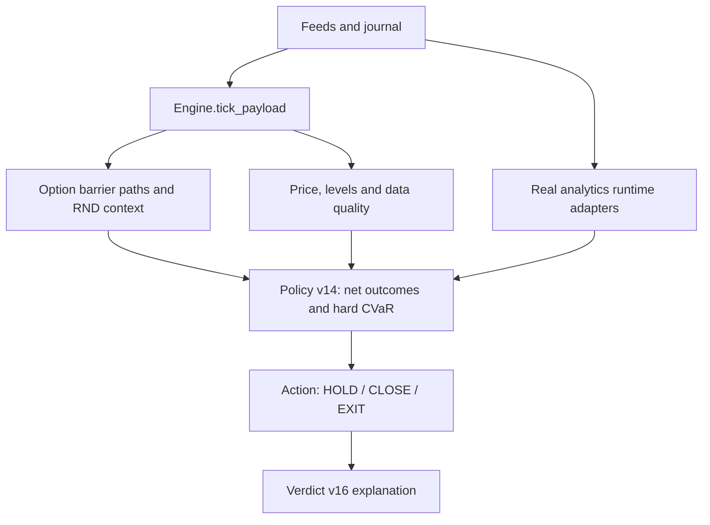

# SEILTANZER Quant Audit — Phase A

Baseline audited: `97dcea5e947ca3107a8ba6dc95f1bee7c185cb61`

Scope: data lineage, mathematical semantics, decision authority, duplication and failure modes.

Phase A changes no production policy choice or visualization.

## Executive result

The architecture is directionally correct: market data is converted into a deterministic policy distribution, hard risk constraints select an action, and the LLM explains that action. The public runtime resolves to `ai_policy_v14` and `ai_verdict_v16`.

The strongest existing contracts are:

- finite-horizon `take-touch / stop-touch / no-touch` are separate outcomes;
- `NO-TOUCH` is not folded into stop probability;
- policy outcomes include execution costs and are compared with a net CVaR floor;
- GEX, Macro, Wavelet and Cross-Asset are explicitly non-independent context;
- the strategy ladder and BE threshold remain hard management constraints;
- production Macro/Wavelet/Cross-Asset use real-data runtime adapters.

The main gaps are not a need for more indicators. They are missing temporal contracts, ambiguous labels and incomplete robustness mechanics:

1. `median_years` is the median time to either barrier, conditional on any resolution. It is not a take median and must be split into take/stop conditional medians.
2. First-touch hazards do not exist yet.
3. Distribution momentum uses a short ordinary slope and simple recent noise. It does not yet satisfy the robust-regression/sample-span contract.
4. Scenario lattice quantiles are generated from the fitted option-parameter process. The label `full_horizon_option_rnd` overstates their relationship to the mapped Breeden–Litzenberger density.
5. GEX wall/flip context exists, but analytic field gradient and curvature do not.
6. Correlation topology contains every finite backend pair, but the frontend suppresses weak links. Correlation deltas also need explicit elapsed-time units.
7. The policy stress set is a useful local sensitivity check, not yet the named regime ensemble required by the specification.
8. Execution-cost fallback `0.01R` is visible, but it needs explicit sensitivity treatment when an advantage is small.
9. Version layering is fragile: `v2…v14` and `v2…v16` rebind functions through module globals. It is covered by tests, but new work must target the public facades and preserve runtime-chain tests.
10. Synthetic prototype methods remain in `Engine`, although package import installs real-data adapters. Calling the unpatched methods directly would be misleading; tests must keep the adapter invariant explicit.

## Runtime data flow

Only family-level states and hard constraints may affect action authority. Individual transforms inside a family do not cast votes.

## Audit matrix

The full machine-readable matrix is in `seiltanzer/metric_contracts.py`. The table below is the review summary.

| Metric | Raw source / formula | Units and cadence | Family / AI role | Disposition | Main risk |
|---|---|---|---|---|---|
| `P(take first touch≤H)` | mapped option inputs; absorbing MC + Brownian bridge | probability; live-price/cache-key and chain cadence | option distribution; core family state | KEEP + IMPROVE | proxy/stale chain/MC error |
| `P(stop first touch≤H)` | same paths | probability; same cadence | same family | KEEP + IMPROVE | near-barrier resolution regression |
| `NO-TOUCH≤H` | `1-pTake-pStop` | probability | same family; time context | KEEP | must never become loss probability |
| Barrier EV | `T*pTake-pStop` | R barrier component | same family; core feature | KEEP + IMPROVE | can be mistaken for full trade EV |
| First-touch median | median resolved touch time | minutes/years | same family; time context | BROKEN / FIX | take and stop times are mixed |
| RND/scenario q10/q50/q90 | terminal fitted process histogram | R; cone cache | same family; geometry | KEEP + IMPROVE | label overstates direct BL origin |
| Distribution width/tails | quantile transforms | R/log ratio | same family; shadow | KEEP + IMPROVE | double counting and unstable thin tails |
| IV / skew / term | real option mids/IV expiries | annualized vol, vol points, ratio; chain cadence | same family; path inputs | KEEP | delayed proxy, sparse strikes, unit mismatch |
| RV / ATR | observed price bars | annualized vol / price | realized-vol family; regime/context | KEEP | gaps and mixed calendars |
| VRP | IV versus RV | ratio/spread | option family; scenario context | KEEP + IMPROVE | mismatched horizons |
| Option derivatives | time series of accepted option states | metric/minute | option family; shadow | KEEP + IMPROVE | two-point noise and horizon roll |
| First-touch hazard | conditional path event rate | probability/window | option family; shadow | KEEP + IMPROVE | sparse survivors/events |
| GEX profile | BS gamma × OI with assumed sign | exposure proxy; chain cadence | option family; context only | VISUAL CONTEXT ONLY | dealer sign unobserved |
| GEX field/force/stiffness | Gaussian field and analytic derivatives | normalized derivatives | option family; shadow/context | KEEP + IMPROVE | bandwidth and sign assumptions |
| Wall/flip migration | tracked mapped GEX levels | price/R/time | option family; context | KEEP + IMPROVE | wall identity switches |
| Live price impulse | real aligned price observations | R / price | live-price family | KEEP | basis and delayed ticks |
| Levels / profile | VWAP/POC/value area/delta | price/R | order-flow levels family | KEEP + IMPROVE | TPO approximation and thin volume |
| Strategy filters | configured/manual state | categorical | hard constraint | KEEP | manual data masquerading as automatic |
| Correlation rho | finite observed matrix pairs | `[-1,1]`; correlation cadence | correlation family; context | KEEP | missing/asynchronous cells |
| Correlation velocity/tension | real matrix history deltas | delta rho / time | correlation family; stress context | KEEP + IMPROVE | irregular sampling and restart history |
| Macro X/Y/Z | real price, vol and correlation stress | normalized state | macro context; no independent vote | VISUAL CONTEXT ONLY | dead synthetic prototype path |
| Macro velocity | actual state displacement/time | state units/hour | macro context | KEEP + IMPROVE | repeated point / dt floor |
| Wavelet energy | real detrended log-price CWT | relative power | derived-price context | VISUAL CONTEXT ONLY | edge effects and over-interpretation |
| Wavelet transfer | change in energy mix over elapsed time | pp/minute | derived-price context | KEEP + IMPROVE | clock-driven fake motion |
| Expected/median net R | policy outcome distribution | R; AI review | policy outcome | KEEP | model and cost misspecification |
| CVaR10 net R | worst-decile mean | R; AI review | hard risk feasibility | KEEP | gross/net inconsistency |
| P(loss) | fraction of net outcomes `<0` | probability | policy diagnostic | KEEP | ignores loss magnitude |
| Stress/source stability | scenario winner/feasibility share | share | robustness gate | KEEP + IMPROVE | inconsistent floors or magic scenarios |
| Execution cost | explicit costs or labelled fallback | R | outcome adjustment | KEEP + IMPROVE | fallback dominates small edge |
| Ladder / BE | configured rungs + acknowledged execution | R/fraction | hard strategy constraint | KEEP | double-counting or unacknowledged fills |

## Probability consistency

The three finite-horizon outcomes satisfy:

\[
P_{take}(H)+P_{stop}(H)+P_{no\ touch}(H)=1.
\]

`barrier EV` is deliberately narrower than full policy expected R:

\[
EV_{barrier}(H)=T\,P_{take}(H)-P_{stop}(H).
\]

It excludes the marked terminal value of paths still alive at the horizon. Policy `expected_net_R`, median, CVaR and P(loss) are calculated from the full policy outcome distribution and must not be replaced by barrier EV.

The mapped BL terminal tails are diagnostics and parameter anchors. A terminal tail ratio is not a first-passage probability and must not be normalized into the headline probability.

## Mathematical-family authority

| Family | Members | Authority |
|---|---|---|
| `option_distribution` | first-touch masses, no-touch, barrier EV, RND quantiles, IV/skew/term, derivatives, hazards, GEX | one aggregated option state; never multiple confirmations |
| `live_price` | price impulse and direction-normalized tape | independent observed-market context |
| `orderflow_levels` | VWAP/POC/value area/profile delta | one levels family |
| `correlation` | rho, delta, velocity, network tension | stress/confidence context; not directional edge |
| `macro_context` | X/Y/Z and transition speed | strategy/context only |
| `derived_price_context` | Wavelet bands, ridge and transfer | explanatory context only |
| `strategy_filters` | required automatic/manual filters | hard constraint, not a vote |
| `policy_outcome` | expected, median, CVaR, P(loss) | joint description of one policy distribution |

## Source quality and stale rules

- Direct/live source quality can support family authority.
- Delayed, indicative or snapshot mapping is discounted and must be labelled.
- Chain age above 30 minutes blocks strong irreversible authority.
- Missing strike support or insufficient terminal tail mass disables the option anchor.
- GEX remains context-only while dealer position sign is unobserved.
- Macro/Wavelet require real observed history; no synthetic production fallback may look real.
- Derivatives require minimum samples, real time span, noise and confidence. Two-point slopes are prohibited.
- A changing expiry/horizon must be attributed separately from a genuine state improvement/deterioration.

## Policy audit

The active facade is `ai_policy.py → ai_policy_v14`.

Current policy outcomes correctly include:

- current remaining position;
- future ladder closes without re-paying already crossed rungs;
- BE only after the configured threshold;
- immediate and deferred execution costs;
- Expected R, median R, CVaR10, P(loss), giveback risk and next-rung/stop geometry;
- hard gross strategy floor exposed alongside the net selection floor;
- parameter stability and source-authority stability.

Limitations to preserve visibly:

- 5m→15m candle trailing is not simulated;
- a `0.01R` fallback cost is an assumption, not broker observation;
- local stress perturbations are not yet the full named regime ensemble;
- policy statistics from one outcome sample are not independent evidence;
- new derived states remain shadow/context until realized-outcome validation.

## Verdict audit

The active facade is `ai_verdict.py → ai_verdict_v16`. The deterministic report is authoritative; GPT may explain but must not alter action arithmetic or thresholds. Stored history includes structured snapshots and execution acknowledgement state.

Required Phase D report contract:

1. action now;
2. what changed since entry, trade-life average and previous review;
3. what improved and deteriorated;
4. what changed the policy;
5. what was ignored because confidence was insufficient;
6. calibrated value and derivative thresholds that would change action.

If a signal does not change the action, the report must say so.

## Animation audit summary

Clock-based movement is acceptable only as a faint UI status cue. Movement that looks like market information must be driven by accepted market/model deltas and decay toward zero when inputs stop changing.

Phase B must preserve the existing frame-budget scheduler, staggered analytics, offscreen suspension, IV mesh reuse, correlation pause, camera gesture budget and lattice smoothness.

## Ordered remediation

- **PR A:** this audit, machine contracts and guard tests only.
- **PR B:** real-market visual dynamics, full Cross-Asset topology and unified camera controls.
- **PR C:** robust option derivatives, split touch-time statistics, local hazards, GEX curvature and transparent interactions in shadow mode.

### PR C resolution note

PR C resolves audit findings 1–2 without breaking the legacy clock: separate
take/stop conditional medians and discrete competing-risk hazards are now
published, while `median_years` remains the compatibility field. Robust option
derivatives, analytic GEX curvature and formula-attributed interactions are
implemented under the non-authoritative shadow contract documented in
`OPTION_DERIVATIVE_SHADOW_CONTRACT.md`.
- **PR D:** named stress ensemble, validated derived-state integration and deterministic verdict attribution.

No derived metric receives live policy authority merely because it is mathematically plausible.
